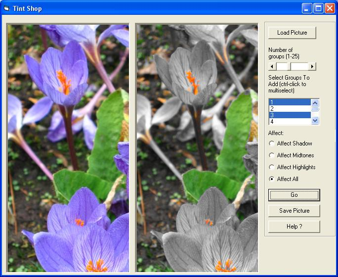

<div align="center">

## Tint Shop


</div>

### Description

I found a program Tint, I wanted to see if I could create the same effect. It breaks a picture into hue groups that you can select, this program also goes one better than the original because you can effect only shadow, midtone, highlight or all (luminance). It can create some good effects, let me know what you think. It uses getpixel, setpixel, there are better / faster ways but it works well enough, make sure you compile and it runs acceptably.
 
### More Info
 


<span>             |<span>
---                |---
**Submitted On**   |2007-11-26 14:58:10
**By**             |[Apeiron](https://github.com/Planet-Source-Code/PSCIndex/blob/master/ByAuthor/apeiron.md)
**Level**          |Intermediate
**User Rating**    |5.0 (15 globes from 3 users)
**Compatibility**  |VB 6\.0
**Category**       |[Graphics](https://github.com/Planet-Source-Code/PSCIndex/blob/master/ByCategory/graphics__1-46.md)
**World**          |[Visual Basic](https://github.com/Planet-Source-Code/PSCIndex/blob/master/ByWorld/visual-basic.md)
**Archive File**   |[Tint\_Shop20917011232007\.zip](https://github.com/Planet-Source-Code/apeiron-tint-shop__1-69667/archive/master.zip)

### API Declarations

```
GetPixel
SetPixel
```


